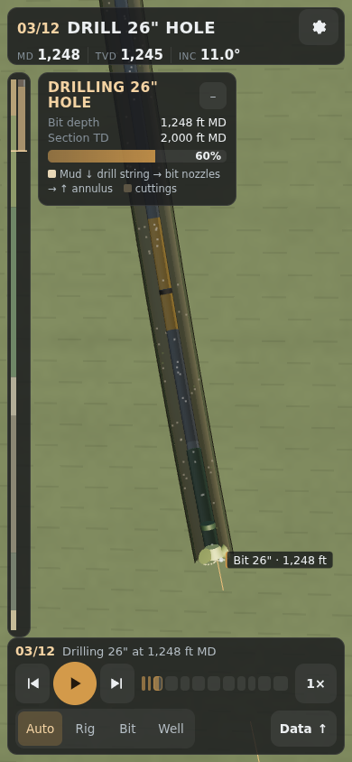
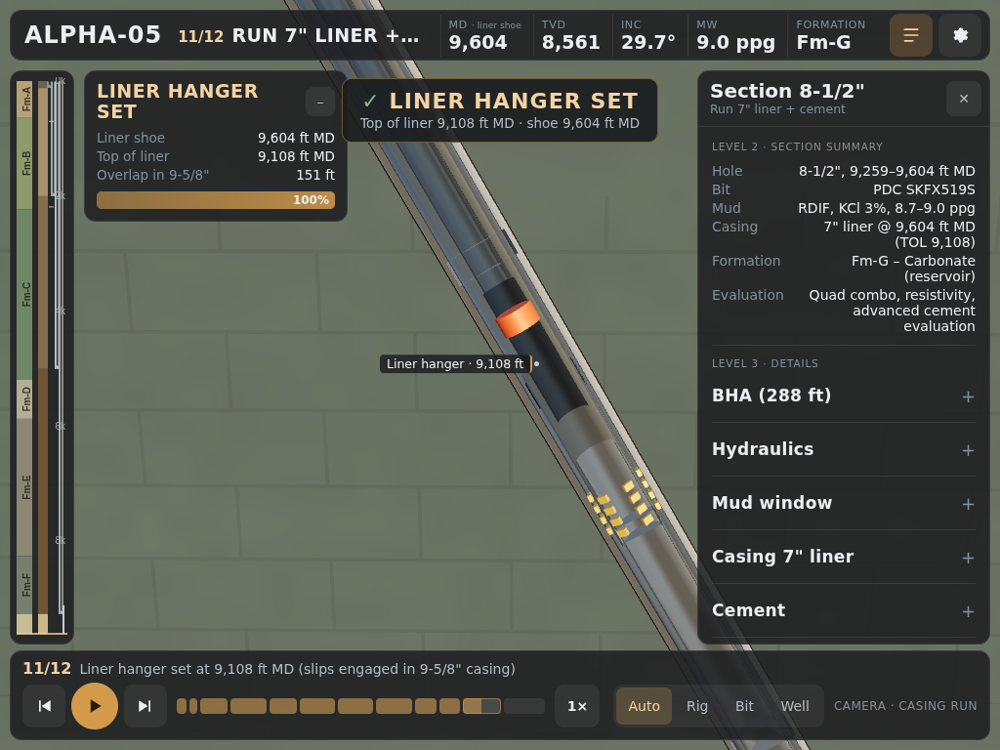

# Alpha-05 — Interactive Well Construction Digital Twin

[](https://muhammadfakhri-helmi.github.io/alpha05-drilling-3d/)

**Live:** https://muhammadfakhri-helmi.github.io/alpha05-drilling-3d/


Alpha-05 is an interactive 3D well construction visualization built with JavaScript and Three.js.
It turns drilling engineering data into a real-time browser visualization of the well trajectory,
BHA, drill string, casing programme, cementing, well-control equipment, liner installation,
completion, ESP, tubing and production.

It is not a pre-rendered animation. Every piece of downhole equipment is placed by **measured
depth along the planned trajectory**, so the whole construction sequence can be scrubbed, paused,
orbited and inspected on a phone, a tablet or a desktop.

The well is anonymised: the well name, operator, location, coordinates and costs have been removed,
and formations are named Fm-A … Fm-G. All values are **plan** data, not actuals.

| Phone portrait (drilling the build section) | Tablet landscape (liner hanger set) |
|---|---|
|  |  |

More screenshots are in [`docs/screenshots/`](docs/screenshots/).

---

## Purpose

The project shows two things together:

1. **Drilling engineering:** a consistent J-type well design (KOP 700 ft, 2°/100 ft build to
   29.74°, TD 9,604 ft MD / 8,561 ft TVD) with its casing, mud, hydraulics, cement, well-control and
   completion programme.
2. **Interactive technical visualization:** a data-driven, MD-based Three.js scene with an
   operational state machine, a trajectory-aware camera and a responsive engineering UI.

## Operation sequence

The 12 main operations on the timeline are each broken into sub-steps:

| # | Operation | Sub-steps |
|---|---|---|
| 01 | Rig ready | — |
| 02 | Install 30" conductor | — |
| 03 | Drill 26" | Trip in → drill (through KOP and the build section) |
| 04 | Run 20" casing + cement | Condition hole → POOH BHA → prepare casing → pick up → run → land → cement → plug bump → wellhead / BOP |
| 05 | Drill 17-1/2" | Trip in → drill out shoe → drill |
| 06 | Run 13-3/8" casing + cement | as 04 |
| 07 | Drill 12-1/4" | Trip in → drill (controlled drilling approaching Fm-G) |
| 08 | Run 9-5/8" casing + cement | as 04 |
| 09 | Drill 8-1/2" | Trip in → drill the reservoir |
| 10 | Wireline logging | Condition → POOH → RIH → log up → POOH |
| 11 | Run 7" liner + cement | Prepare → run on DP → set hanger → cement → release running tool → POOH |
| 12 | Completion | TCP perforate → POOH → run ESP + tubing → nipple down BOP → nipple up X-mas tree → production |

## Technical stack

- **Three.js** (r186, ES modules, `three/addons`): rendering, OrbitControls, BufferGeometry-based tubulars
- **GSAP**: discrete camera transitions only (continuous motion runs in `requestAnimationFrame`)
- **Vite**: dev server and production build
- Plain HTML/CSS for all UI (no framework)
- `node --test` for engine and state-machine tests

```bash
npm install
npm run dev       # local dev server
npm run build     # production build -> dist/
npm run preview   # serve the production build at /alpha05-drilling-3d/
npm test          # trajectory + state machine tests
```

## Architecture

```
index.html                 UI shell (HUD, timeline, panels, loader)
src/
  main.js                  bootstrap + frame loop (state → scene → camera → UI)
  constants.js             units, radial exaggeration, surface taper, joint lengths
  engineeringData.js       the well plan (unchanged values)
  trajectory.js            MASTER TRAJECTORY ENGINE
  stateMachine.js          stateAt(t): 12 operations × sub-steps → MD values
  scene/                   renderer + view offset, lighting / sky / environment
  well/
    tubular.js             TrajectoryTube (curved, in-place updatable) + JointInstancer
    stringAssembly.js      bottom-up string: components + pipe body + joints
    bha.js                 BHAs per section, bit meshes
    casing.js  liner.js    casing strings / 7" liner, hanger, running string
    cement.js              cement jobs along the flow path
    wellbore.js            open hole walls, mud column
    completion.js          wireline, TCP, perforations, ESP + tubing
    fluids.js              mud / cement / oil particles
    formations.js          per-pixel formation cross-section shader
  surface/                 rig, pipe handling, wellhead / BOP / tree
  camera/                  trajectory-aware camera controller
  ui/                      responsive layout, HUD, timeline, engineering panel / bottom sheet,
                           labels (collision), selection (raycast), depth track
  utils/                   math, materials, procedural textures, adaptive quality
tests/                     node:test suites
```

Data flows one way: `time → stateAt(t) → MD values → trajectory engine → geometry`. The state
machine contains no Three.js code, which makes it deterministic and testable.

## Trajectory engine (`src/trajectory.js`)

This is the single source of truth for every downhole position:

```js
survey(md)            // { md, tvd, vs, inc }
getPosition(md)       getTangent(md)   getNormal(md)   getBinormal(md)
getQuaternion(md)     getTrajectoryFrame(md)   placeAtMD(object, md)
sampleMDs(a, b, …)    // adaptive ring sampling (fine in the build, coarse on tangents)
TrajectoryCurve       // THREE.Curve over an MD interval (MD is arc length)
```

The profile is the exact minimum-curvature solution for a J-type well. The local equipment frame
maps **+Y to uphole**, +X to the in-plane normal and +Z to the binormal, which faces the cutaway
viewer. Because the well is planar, the frame never twists or flips. Tests confirm that the engine
reproduces EOB 2,187 ft, TD TVD 8,561 ft, every casing-shoe TVD and every formation MD/TVD pair.

## Drill string / BHA geometry

The old mockup drew the BHA as one rigid group aligned to the tangent at the bit. That produced a
visible kink in the build section (a ~315 ft BHA spans ~6.3° at 2°/100 ft).

Now every BHA component occupies its **own MD interval** (bit 1.5 ft, motor 30 ft, MWD 30 ft …
true lengths from the plan). Each one is drawn as a `TrajectoryTube`: a pre-allocated
BufferGeometry whose rings are re-placed on the trajectory every time the string moves, with no
allocation. Drill pipe runs from the BHA top to the top drive, and tool joints are instanced every
31 ft. Diameter steps get shoulder rings. The bit face sits exactly at bit MD.

Rotation is shown by spinning the bit, the stabiliser blades and the bands about the local hole
axis, and by scrolling drill-pipe texture bands. The curved geometry itself is never rotated.

## Casing running system

Running casing is shown as an operation, not as geometry growing down the hole:

1. POOH the BHA (the camera follows it up), then switch to the rig floor.
2. **Prepare / pick up:** casing joints sit on the pipe rack, and the shoe joint travels along the
   catwalk, up the V-door ramp and into the elevator at well centre.
3. **Run:** the first two joints are picked up and stabbed one at a time. The run then speeds up.
   The shoe and the instanced couplings (every 40 ft) are laid out from the **shoe upward**, so
   they visibly travel downhole while the top drive cycles. The HUD shows shoe depth, planned shoe,
   progress and an estimated joint count (labelled as such).
4. **Land:** the last joint is lowered slowly and a "CASING LANDED — shoe … ft MD" banner appears.
5. **Cement**, then wellhead and BOP changes for the next section.

The casing shoe is a rounded guide shoe with a subtle highlight ring. A float collar marks the
80 ft shoe track.

## Liner system

`running string (5" DP) → running tool → liner hanger (packer + slips) → 7" liner → liner shoe`

The liner exists only between TOL (9,108 ft) and TD (9,604 ft). It is made up at surface, run on
drill pipe, landed, and the hanger slips expand into the 9-5/8" casing. Cement goes down the drill
pipe and liner and up to TOL. The running tool then releases (a visible gap opens) and is pulled
out of hole.

## Cementing visualization

Each cement job is modelled along its flow path: **down inside the pipe → out of the shoe → up
the annulus to TOC**. Every slurry stage (for example the 20" lead and tail) is a slug on that
path, followed by displacement fluid. A red bottom plug rides on the cement front and a black top
plug on the tail, bumping on the float collar. Particles move along the same path. Fluids are
placed by length rather than volume (see `ENGINEERING_REVIEW.md`).

## Camera modes

| Mode | Behaviour |
|---|---|
| Rig / Rig floor / Wellhead | fixed surface poses (orbit freely) |
| Follow bit | tracks the bit with an offset in the **local trajectory frame**; looks slightly uphole to include the BHA |
| Casing run / Cementing / Completion | track the shoe, the cement front, or the perforations and ESP |
| Entire well | fits rig-to-TD inside the *unobstructed* viewport |

`target = P(md + lookAhead)` and `position = target + R(md) · offsetLocal`. User orbit, zoom and pan
are read back into the local frame each frame, so manual framing persists while tracking. The
camera never rolls. Mode changes blend with a single GSAP tween. Close-up distances scale with the
size of the hole being worked in.

**Auto** lets the operation choose the view. **Rig / Bit / Well** lock it until Auto is pressed
again (keys 1–4).

The camera's principal point is moved to the centre of the area not covered by the UI
(`setViewOffset`, focal length preserved). The scene therefore stays centred when the engineering
panel or bottom sheet opens.

## Responsive design

There are five intentionally different layouts (chosen from the visible viewport, not just its
width):

| Layout | When | Structure |
|---|---|---|
| `phone` | < 600 px portrait | 2-line HUD, compact depth strip (tap to expand), 3-row timeline, engineering **bottom sheet** (closed / half / full with explicit buttons) |
| `phone-land` | landscape, ≤ 500 px tall | single-line status bar, single-row timeline, side drawer |
| `tablet` | 600–1100 px portrait | compact HUD, slim track, 2-row timeline, bottom sheet |
| `tablet-land` | 900–1200 px landscape | collapsible right panel (300 px), slim track |
| `desktop` | ≥ 1200 px | engineering side panel, full depth track, full timeline |

The layouts use `100dvh` (falling back to `100vh`) and safe-area insets on every edge. Touch targets
are ≥ 44 px. Nothing essential needs hover, right-click or a keyboard. A `ResizeObserver` plus
visual-viewport listeners handle rotation and toolbar changes without reloading or recreating the
scene. Labels use priority levels (phone: high only; tablet: + medium; desktop: all) and
screen-space collision avoidance against each other and against the HUD, timeline, panels and
cards. Tap any equipment to open a compact card: what it is, its MD interval, and what it is doing
now.

## Performance strategy

- Quality modes: **Auto** (default), Low, Medium and High. They change pixel-ratio caps, sun
  shadows, particle budget (≈320 to 1,300) and environment reflections, but never remove
  engineering information.
- Auto starts from the device class and adjusts the pixel ratio in 0.25 steps from a rolling FPS
  measurement.
- Geometry: in-place updated BufferGeometry tubulars with adaptive ring sampling (≈ 4–10 ft in the
  build, up to 150 ft on straight tangents). Couplings, tool joints, perforations and the pipe rack
  are `InstancedMesh`. Materials are shared.
- One `Points` draw call for all fluid particles. Shadows are limited to the surface pad.
- No downloads besides code: textures, the sky environment (PMREM) and the formation section are
  procedural.

## Verification

`npm test` checks the trajectory against the plan, the state-machine continuity, the casing
landing depths, the liner interval, and the cement flow direction. The production build was run
in headless Chromium:

- A full timeline sweep (every sub-step), all camera modes, and a portrait ↔ landscape rotation
  without reload: **0 runtime errors**.
- 19 viewport sizes (320×568 … 1920×1080, portrait and landscape): no overlap between the HUD,
  timeline, operation card and depth track; no clipped controls; touch targets ≥ 32 px visible
  (≥ 44 px hit area). The 3D area is **66–77 %** of the screen on phones and **78–84 %** on tablets
  and desktops.

Real-device GPU and touch testing still needs doing on physical phones and tablets.

## GitHub Pages deployment

`vite.config.js` uses `base: '/alpha05-drilling-3d/'` for build and preview.
`.github/workflows/deploy.yml` builds, tests and deploys `dist/` on every push to `main`.

**One-time setup:** in the repository go to **Settings → Pages → Build and deployment → Source**
and select **GitHub Actions**. The previous "Deploy from branch / root" setting would serve the
unbuilt source.

## Documentation

- [`ENGINEERING_REVIEW.md`](ENGINEERING_REVIEW.md): data checks, inconsistencies to verify, and
  every visual assumption and exaggeration
- [`CHANGELOG.md`](CHANGELOG.md): what changed and known limitations

## Notes

Hole and tubular diameters are exaggerated 5× downhole (2× at surface) so they can be seen in one
view. MD positions, shoe depths, KOP, EOB and TD are true. The data shown is plan data.
